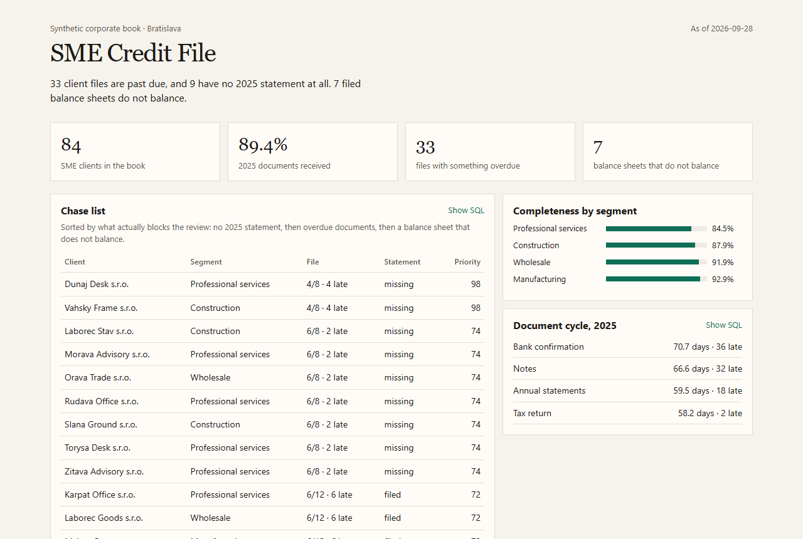

# SME Credit File

[](https://github.com/LiKeT128/sme-credit-file/actions/workflows/build.yml) · **[Live dashboard (static snapshot) →](https://liket128.github.io/sme-credit-file/)**

A local tool for one question: which client files in a fictional Bratislava corporate book are not ready for the annual review, and which filed numbers should not be analysed yet.

84 SME clients. Statements for 2023–2025. Four documents requested for 2025: annual statements, notes, tax return, bank confirmation.

On the seeded book, 33 files are past due, 9 have no 2025 statement, 89.4% of requested documents have arrived, and 7 balance sheets do not satisfy assets = equity + liabilities.



## Run

```powershell
python build_db.py
python app.py
```

Open http://127.0.0.1:8765

Python 3.11+ and the standard library. No packages.

`python export_static.py` freezes every API response into `site/`, so the same page runs without a server. That snapshot is what the live link serves. `build_db.py` uses a fixed seed, so the story stays the same unless the generator changes.

## What the SQL does

The views in `schema.sql` are the analysis. The app only reads them.

- `v_file_status` counts documents received against documents requested, and flags anything overdue against `date('now')`.
- `v_statement_quality` computes the balance-sheet gap and the net margin. A gap of €1,000 or more is treated as a capture error.
- `v_segment_margin` is the peer group: average net margin by segment and year.
- `v_chase_list` is a queue. A missing 2025 statement ranks above overdue documents, which rank above a broken filing, which ranks above a margin that sits 20 points or more from its segment.

The same queries are saved in `sql/` so they can be read without starting the app. Clicking a client shows three years of statements and the state of each document. **Show SQL** prints the query behind the table.

## Data

`companies`, `statements`, `documents`. Names, IČO numbers, and figures are generated. This is not a bank extract and not FinStat.

## What this does not do

It does not score credit risk. A default model needs a labelled history of who failed to pay. This case is the step before that: the file has to be complete, and the statements have to balance, or the ratio is not a finding.
